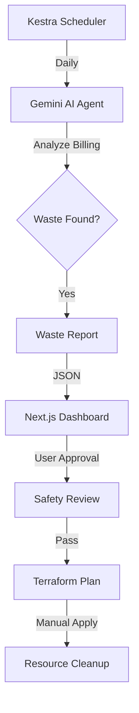

🧹 Cloud Janitor — The Autonomous FinOps Agent

An AI-powered FinOps platform that detects wasted cloud resources, explains why they matter, and generates safe Infrastructure-as-Code to eliminate them — with humans firmly in control.

🌐 Live Demo

[https://cloud-janitor-finops.vercel.app](https://cloud-janitor-finops.vercel.app)


🚨 The Problem

Cloud waste is a $30B+ global problem.

Teams routinely forget:
Development servers running 24/7
Unattached storage volumes
Old snapshots kept indefinitely
Idle RDS databases and test environments
Manual audits are slow. Writing cleanup scripts is risky.
The result is silent, compounding cost leakage.

💡 The Solution

Cloud Janitor is a safety-first FinOps automation loop.
It is intentionally read-only by default and only proposes changes until a human explicitly approves them.

The system:

1. Detects zombie cloud resources on a daily schedule
2. Explains why each resource is wasteful using AI-generated insights
3. Calculates exact monthly and annual savings
4. Generates Terraform Infrastructure-as-Code for cleanup
5. Requires human approval and safety confirmation before destruction

This shifts FinOps from spreadsheets and alerts to explainable, reviewable automation.

🏆 Sponsor Integrations

Cloud Janitor integrates four sponsor tools as first-class system components.

| Sponsor            | Role                   | Usage                                                                                                                                                            |
| ------------------ | ---------------------- | ---------------------------------------------------------------------------------------------------------------------------------------------------------------- |
| Kestra + Gemini AI | AI Orchestration       | Kestra runs daily FinOps workflows. Its AI Agent, powered by Gemini 1.5 Pro, analyzes billing data, identifies waste patterns, and produces structured insights. |
| Cline              | Autonomous Development | Cline designed the system architecture, authored workflows, built the dashboard, generated Terraform, and integrated all components across multiple languages.   |
| CodeRabbit         | AI Code Review         | All generated Terraform is reviewed for safety. The dashboard simulates a CodeRabbit approval step before any deployment.                                        |
| Vercel             | Deployment Platform    | Hosts the Next.js dashboard with automatic CI/CD, global CDN, and instant previews.                                                                              |

✨ Key Features

AI-Powered Waste Detection
Gemini-based analysis of billing and usage patterns
Natural language explanations for each zombie resource
Daily scheduled audits via Kestra
Structured JSON reports with savings breakdowns
 
 


✨ Autonomous Code Generation

Terraform IaC generated for detected waste
Precise targeting of EC2, EBS, RDS, S3, and snapshots
Inline safety documentation in generated code
No automatic execution — code is proposed, not applied

✨ Safety guarantees:

Destruction disabled by default
Double confirmation required
No accidental terraform apply
Human-in-the-loop enforced

✨ Dashboard Experience

A production-ready Next.js interface featuring:
Dark-mode glassmorphism UI
Interactive charts using Recharts
Smooth animations with Framer Motion
Responsive layout for all devices
Real-time savings calculations
Approval-based cleanup workflow
Simulated CodeRabbit safety checks

✨ Analytics & Insights

Before and after cost comparison
Savings by resource type
Zombie vs healthy resource ratios
Annualized cost impact projections

🏗️ Architecture



✨ Data Flow:

1. Kestra triggers a scheduled audit
2. Gemini AI analyzes billing data (mocked in demo)
3. Waste reports are generated with savings estimates
4. Dashboard visualizes findings
5. User reviews and approves actions
6. Terraform code is generated but not auto-applied

🚀 Installation

✨ prerequisites

Docker (Kestra)
Node.js 18+
npm or yarn

Clone the Repository

```bash
git clone https://github.com/yourusername/cloud-janitor.git
cd cloud-janitor
```

Start Kestra

```bash
docker-compose up -d
```

Kestra UI: [http://localhost:8080](http://localhost:8080)

Run the Dashboard

```bash
cd dashboard
npm install
npm run dev
```

Dashboard: [http://localhost:3000](http://localhost:3000)

📁 Project Structure

```
cloud-janitor/
├── dashboard/        # Next.js 14 App Router
├── kestra/           # Workflow orchestration
├── terraform/        # Generated IaC with safety locks
├── mock_data/        # Simulated billing data
└── docker-compose.yml
```

---

🎯 Usage

Run an Audit

Open Kestra UI
Execute cloud-janitor-ai-audit
Review generated waste report

Review Findings

Open the dashboard
Inspect zombie resources
Analyze projected savings

Approve Cleanup

Approve deletion in UI
Pass CodeRabbit safety simulation
Review Terraform plan
Apply manually if desired

🌍 Impact

Demo scenario:

Monthly bill: $12,500
Zombies detected: 5
Monthly savings: $626.84
Annual savings: $7,522

Enterprise scale:

$1M/month cloud spend
5 percent waste reduction
$600,000 saved annually

🚫 Non-Goals (By Design)

Cloud Janitor does not:

Auto-apply destructive changes
Manage IAM permissions
Access real cloud accounts in demo mode
Bypass human approval

Safety and explainability take priority over full autonomy.

🛡️ Security & Safety

No hardcoded secrets
Environment-variable based configuration
Terraform safety locks
Human-in-the-loop enforcement
Audit logs via Kestra
Mock data only in demo

🏆 Why This Wins

Cloud Janitor demonstrates that autonomous agents can operate across the full infrastructure lifecycle without removing human control.

It combines AI reasoning, orchestration, infrastructure-as-code, and safety validation into a single, coherent system.

This is not AI deleting resources.
It is AI doing the thinking so humans can make better decisions.

📄 License

MIT License

🙏 Acknowledgments

Built for AssembleHack’25 using Cline, Kestra, Google Gemini, CodeRabbit, and Vercel.
